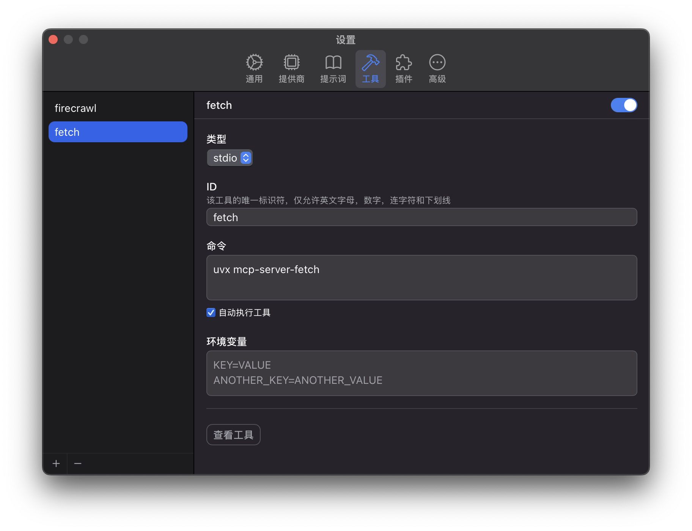

import vid1 from "./chatwise-mcp-files/vid-1.mp4"
import vid2 from "./chatwise-mcp-files/vid-2.mp4"

## MCP 是什么

MCP 是一个让模型访问外部资源的规范，由 Claude 的开发商 Anthropic 提出。

开发者可以根据 MCP 规范实现一些服务 (server)，然后模型可以通过这些服务获取额外的能力和上下文，比如使用网络搜索、操控外部浏览器等等。

模型可以通过两种方式访问到这些 MCP 服务：

- 命令行输入输出 (stdio)：更适用于本地服务，比如需要访问本地文件、操控本地应用
- SSE 请求 (SSE)：更适用于远程服务， 比如使用 gmail 发送邮件

更完整的介绍可以参考官方文档 https://modelcontextprotocol.io/docs/concepts/transports

## 哪些模型支持 MCP

MCP 的支持在各个客户端中都不同，Claude 官方客户端当然只有 Claude，而在 ChatWise 里理论上所有模型都支持 MCP，只是模型使用工具的能力强弱不同，模型的上下文最好在 16K 以上才能更好地调用工具。

在我的使用中免费的 Gemini 2.0 Flash，价格很便宜的 DeepSeek V3，还有 Doubao Pro 128K 都能比较好地调用工具。

## 安装命令行工具

如果是基于命令行的 MCP 服务，往往是用 python 和 node.js 写的:

- python 写的服务可以通过 `uvx` 使用
- node.js 写的服务可以通过 `npx` `pnpx` `bunx` 使用

根据你要是用的 MCP 来决定要安装哪个。

### 安装 uvx

`uvx` 是 `uv` 这个程序自带的命令，安装 `uv`:

```shell
# windows
powershell -ExecutionPolicy ByPass -c "irm https://astral.sh/uv/install.ps1 | iex"

# macOS
curl -LsSf https://astral.sh/uv/install.sh | sh
```

### 安装 npx

`npx` 是 Node.js 自带的命令，访问 [Node.js](https://nodejs.org/zh-cn)官方下载。

## 使用 MCP

在 ChatWise 的工具设置里，可以点击左下角的`+`号添加 MCP 服务:



以这个 [mcp-server-fetch](https://github.com/modelcontextprotocol/servers/tree/main/src/fetch) 为例，可以用来获取网页内容的，可以通过 `uvx mcp-server-fetch` 这个命令运行，当这个命令运行时 `uvx` 这个程序就会自动下载 `mcp-server-fetch`并运行它。

在这里可以勾选「自动执行工具」，因为获取网页这个操作一般是安全的，不需要用户确认。

然后你就可以添加 MCP 服务到你的助手里：

<video controls muted src={vid1} />

输入框下面这些按钮都是作用于整个助手，比如在这里启用了相应的 MCP 服务之后，新建一个对话也会使用这些 MCP 服务（过去的对话不受影响）。

示例，用 fetch 来总结一篇文章：

<video controls muted src={vid2} />

---

通过组合搜索+获取网页内容的 MCP 服务你就可以配合[系统提示词](https://x.com/localhost_4173/status/1901250213282799776)实现一个类似深度搜索的功能，也就是在搜索之后让模型依次分析每个网页，直到获取足够的信息。比如这些方案：

- [mcp-server-brave](https://github.com/modelcontextprotocol/servers/tree/main/src/brave-search) + [mcp-server-fetch](https://github.com/modelcontextprotocol/servers/tree/main/src/fetch): Brave 搜索 + 网页获取
- [tavily-mcp](https://docs.tavily.com/documentation/mcp): 基于 tavily 搜索的 MCP，本身就会获取网页内容，所以不需要 mcp-server-fetch
- [firecrawl-mcp](https://github.com/mendableai/firecrawl-mcp-server): 可以操纵浏览器，也就意味着可以用来访问 google 搜索

## 在哪里找 MCP 服务

除了[官方的 MCP 服务](https://github.com/modelcontextprotocol/servers/tree/main/src)可以使用外，[mcp.so](https://mcp.so/zh?utm_source=chatwise) 上还收录了大量优质 MCP 服务可供选择。