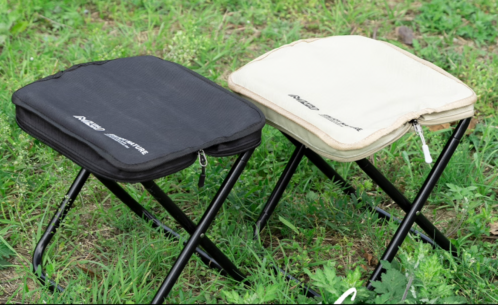

上周因为最近成都实在是很热，我在想什么地方不那么热去玩几天，最后在云南、贵州和九寨沟之间选择了最后者。

其实我在大学的时候去过九寨沟，不过那是遥远的十年前了，现在对九寨沟的样子早就忘得一干二净。而且上次去的时候还没有高铁，应该是坐了很久大巴，现在高铁已经开到九寨沟附近的松潘县，从成都坐一个半小时高铁到镇江关站，然后再坐三个小时大巴直达九寨沟景区。在路上我经过了还没正式运行的黄龙九寨高铁站，听说是年底前通车，不过距离真正的景区也还有几十公里，到时还是免不了坐大巴，不过也许一个小时内就能到。

这也是咱第一次没抢到高铁票，谁能想到一个普通的工作日还有这么多人去九寨沟，让我只买到了站票。一个半小时高铁不是开玩笑的，咱腰也不太好，所以网购了一个折叠椅子在高铁上坐。

这是钱包式的椅子，可以折叠成一个钱包的样子，不过实际体验是收起来的时候不太方便，连接处的螺丝很容易在扭的时候跑偏，体重大一点的人坐久了连接处也会压得比较紧，导致收回去很麻烦。不过凑活一下也还行。

一下高铁就会感到有点冷，高原应该都是类似的气候，只要不是阳光直射就很凉快，就算太阳很大也不会有闷热的感觉。之后坐三小时大巴从高铁站到九寨沟还下起了太阳雨，也是平原很少见的事。

九寨沟里最好看的景点 —— 长海是因为地震而形成的堰塞湖，应该是九寨沟里最大的湖，有点像迷你版的泸沽湖，但被四周的山夹住，非常独特。除此之外其它的湖就有点黯然失色了，不过还有些瀑布也挺好看，主要是瀑布周围超级凉快。

对于九寨沟的具体景色咱就不细说了，没那个文学功底。

第二天咱去了九寨沟附近黄龙景区，黄龙的海拔比九寨沟高一些，最高处五彩池大概 3500m，去黄龙的路上会有所谓 "黄龙高反协会" 的工作人员向你推销抗高反的口服液和氧气罐，她们会手舞足蹈讲一些以前那些没有喝这些药去了黄龙回来之后变成傻瓜的故事，主张一个买不了吃亏买不了上当，上当总比变傻好，是非常接地气的营销方式。其实完全可以不用理会。

去黄龙就是爬山，从入口爬到最高处五彩池，你可以选择从入口坐缆车省略大部分景点直接到五彩池附近，或者从入口直接步行到五彩池。我选择了不行，这样不用花钱坐缆车。来回大概四公里，海拔从 3000m 爬升到 3500m，我早上 10 点进入下午 2 点出去。

黄龙里面一路上就是如下的溪流，因为整个是从高往低，所以也许也可以说是一个瀑布：

抵达最高处的五彩池让我感觉一百多的票价非常不值：

去程的高铁买到了站票，但是回程连站票都没抢到，好在最后一刻抢到了计划返回日期的第二天早上九点的票，于是只能在高铁站旁边的酒店住了一晚。而镇江关高铁站附近的镇子可以说是人迹罕至，虽然两边都有店铺但是 90% 处于关门状态，开着的大多都是宾馆和饭店。而这些宾馆的结构都是一楼为便利店二楼为便利店老板开的宾馆。我在手机上订的房间，过去的时候老板娘就在门口洗衣服，没有前台这些花里胡哨占地方的东西，表明来意后就直接告诉我一个房间号叫我上去就行，入住手续即完成，也就是没有手续，身份证也不用。第二天早上咱也是直接就走了，老板娘都没看见，这种住宿效率颇高，唯一能抱怨的只有走廊看起来像监狱，房间里面的消毒水气味像病房，窗外还有无数飞虫拼命想往里钻。

回到成都之后气温进一步飙升，也基本不下雨了，让我十分想念这三天在九寨沟又能晒太阳又凉快的日子。
